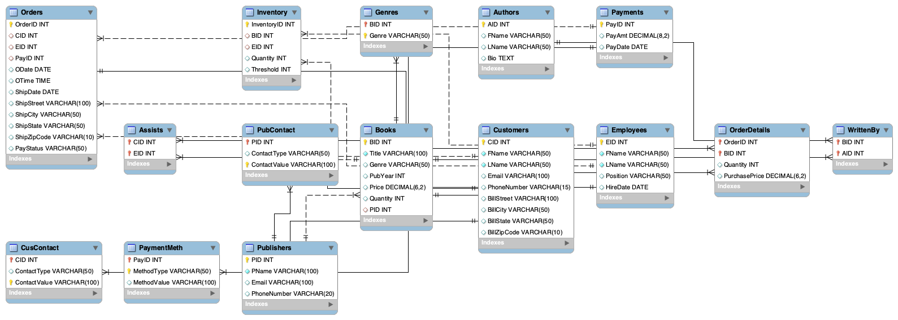

# 📚 BookstoreDB SQL Scripts

**Created by:** Tenzin Chonyi, Kalden Sopa, Tenzin Gendun  
**x500:** chony003, sopa0002, gendu002
**Course:** CSCI 4707 – Group Project 2  

---

## 📖 Overview

This project implements a **Bookstore Management System** using MySQL. Each `.sql` file defines one table in the database, following the Relation Schema we designed.  
All scripts were written and tested using **MySQL Workbench**, with the default schema set to `BookstoreDB`.

---

## 🗂️ Execution Order

Run the scripts in this order (as tested in MySQL Workbench):

1. `Customers.sql`  
2. `Employees.sql`  
3. `Publishers.sql`  
4. `Books.sql`  
5. `Authors.sql`  
6. `WrittenBy.sql`  
7. `Inventory.sql`  
8. `Payments.sql`  
9. `Orders.sql`  
10. `OrderDetails.sql`  
11. `Assists.sql`  
12. `Genres.sql`  
13. `CusContact.sql`  
14. `PubContact.sql`  
15. `PaymentMeth.sql`

---

## 📝 Design Notes

- All foreign key relationships are explicitly declared.
- Instead of having `InventoryID` as a foreign key in `Books` (as in the original schema), we reversed the relationship and made `BID` a foreign key in `Inventory` to better associate each inventory entry with a specific book.
- `Genres` table contains a `Genre` attribute to represent book genres cleanly.
- `CusContact`, `PubContact`, and `PaymentMeth` were each given a `ContactType`/`MethodType` and corresponding `ContactValue`/`MethodValue` instead of fixed fields like `Phone` or `Email`, allowing more flexible data storage.

---

## 🖼️ EER Diagram

The schema was also visualized using the EER Diagram feature in MySQL Workbench:

> ✅ *Diagram file included in this repo:* `MySQLWorkbenchEER.png`
